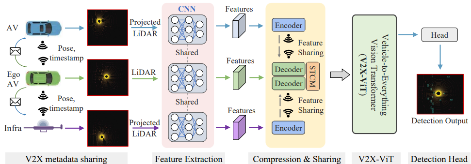

[](https://paperswithcode.com/sota/3d-object-detection-on-v2xset?p=v2x-vit-vehicle-to-everything-cooperative)

# [V2X-ViT](https://arxiv.org/abs/2203.10638): Vehicle-to-Everything Cooperative Perception with Vision Transformer (ECCV 2022)

[](https://arxiv.org/abs/2203.10638)
[]()
[]()


This is the official implementation of ECCV2022 paper "V2X-ViT: Vehicle-to-Everything Cooperative Perception with Vision Transformer".
[Runsheng Xu](https://derrickxunu.github.io/), [Hao Xiang](https://xhwind.github.io/), [Zhengzhong Tu](https://github.com/vztu), [Xin Xia](https://scholar.google.com/citations?user=vCYqMTIAAAAJ&hl=en), [Ming-Hsuan Yang](https://scholar.google.com/citations?user=p9-ohHsAAAAJ&hl=en), [Jiaqi Ma](https://mobility-lab.seas.ucla.edu/)

UCLA, UT-Austin, Google Research, UC-Merced

**Important Notice**: [OpenCOOD](https://github.com/DerrickXuNu/OpenCOOD) supports V2X-ViT and V2XSet now! We will **no longer** update this repo, and all the new features (e.g. multi gpu implementation) will only be updated in OpenCOOD.



## Installation
```bash
# Clone repo
git clone https://github.com/DerrickXuNu/v2x-vit

cd v2x-vit

# Setup conda environment
conda create -y --name v2xvit python=3.7

conda activate v2xvit
# pytorch >= 1.8.1, newest version can work well
conda install -y pytorch torchvision cudatoolkit=11.3 -c pytorch
# spconv 2.0 install, choose the correct cuda version for you
pip install spconv-cu113

# Install dependencies
pip install -r requirements.txt
# Install bbx nms calculation cuda version
python v2xvit/utils/setup.py build_ext --inplace

# install v2xvit into the environment
python setup.py develop
```

## Data
### Download
The data can be found from [this url](https://ucla.app.box.com/v/UCLA-MobilityLab-V2XVIT).  Since the data for train/validate/test
is very large, we  split each data set into small chunks, which can be found in the directory ending with `_chunks`, such as `train_chunks`. After downloading, please run the following command to each set to merge those chunks together:

```
cat train.zip.part* > train.zip
unzip train.zip
```
If you have good internet, you can also directly download the whole zip file, e.g. train.zip
### Structure
After downloading is finished, please make the file structured as following:

```sh
v2x-vit # root of your v2xvit
├── v2xset # the downloaded v2xset data
│   ├── train
│   ├── validate
│   ├── test
├── v2xvit # the core codebase

```
### Details
Our data label format is very similar with the one in [OPV2V](https://github.com/DerrickXuNu/OpenCOOD). For more details, please refer to the [data tutorial](docs/data_intro.md).

### Noise Simulation
One important feature of V2XSet is the capability of adding different communication noises. This is done in a post-processing approach through our flexible coding framework. To set different noise, please
refer to [config yaml tutorial](docs/config_tutorial.md).

## Getting Started
### Data sequence visualization
To quickly visualize the LiDAR stream in the V2XSet dataset, first modify the `validate_dir`
in your `v2xvit/hypes_yaml/visualization.yaml` to the V2XSet data path on your local machine, e.g. `v2xset/validate`,
and the run the following commond:
```python
cd ~/v2x-vit
python v2xvit/visualization/vis_data_sequence.py [--color_mode ${COLOR_RENDERING_MODE}]
```
Arguments Explanation:
- `color_mode` : str type, indicating the lidar color rendering mode. You can choose from 'constant', 'intensity' or 'z-value'.

### Test with pretrained model
To test the pretrained model of V2X-ViT, first download the model file from [google url](https://drive.google.com/drive/folders/1h2UOPP2tNRkV_s6cbKcSfMvTgb8_ZFj9?usp=sharing) and
then put it under v2x-vit/logs/v2x-vit. Change the `validate_path` in `v2x-vit/logs/v2x-vit/config.yaml` as `'v2xset/test'.

To test under perfect setting, change both `async`  and `loc_error`to false in the v2x-vit/logs/v2x-vit/config.yaml.

To test under noisy setting in our paper, change the `wild_setting` as followings:
```
wild_setting:
  async: true
  async_mode: 'sim'
  async_overhead: 100
  backbone_delay: 10
  data_size: 1.06
  loc_err: true
  ryp_std: 0.2
  seed: 25
  transmission_speed: 27
  xyz_std: 0.2
```
Eventually, run the following command to perform test:
```python
python v2xvit/tools/inference.py --model_dir ${CHECKPOINT_FOLDER} --fusion_method ${FUSION_STRATEGY} [--show_vis] [--show_sequence]
```
Arguments Explanation:
- `model_dir`: the path to your saved model.
- `fusion_method`: indicate the fusion strategy, currently support 'early', 'late', and 'intermediate'.
- `show_vis`: whether to visualize the detection overlay with point cloud.
- `show_sequence` : the detection results will visualized in a video stream. It can NOT be set with `show_vis` at the same time.


### Train your model
V2X-ViT uses yaml file to configure all the parameters for training. To train your own model
from scratch or a continued checkpoint, run the following commonds:
```python
python v2xvit/tools/train.py --hypes_yaml ${CONFIG_FILE} [--model_dir  ${CHECKPOINT_FOLDER} --half]
```
Arguments Explanation:
- `hypes_yaml`: the path of the training configuration file, e.g. `v2xvit/hypes_yaml/point_pillar_v2xvit.yaml`, meaning you want to train
- `model_dir` (optional) : the path of the checkpoints. This is used to fine-tune the trained models. When the `model_dir` is
given, the trainer will discard the `hypes_yaml` and load the `config.yaml` in the checkpoint folder.
- `half`(optional): if specified, hybrid-precision training will be used to save memory occupation.

<strong>Important Notes for Training:</strong>
1. When you train from scratch, please first set `async` and `loc_err` to false to train on perfect setting. Also, set `compression` to 0 at beginning.
2. After the model on perfect setting converged, set `compression`  to 32 (please change the config yaml in your trained model directory) and continue training on the perfect setting for another 1-2 epoches.
3. Next, set `async` to true, `async_mode` to 'real', `async_overhead` to 200 or 300, `loc_err` to true, `xyz_std` to 0.2, `rpy_std` to 0.2, and then continue training your model on this noisy setting. Please note that you are free to change these noise setting during training to obtain better performance.
4. Eventually, use the model fine-tuned on noisy setting as the test model for both perfect and noisy setting.

## Citation
 If you are using our V2X-ViT model or V2XSet dataset for your research, please cite the following paper:
 ```bibtex
@inproceedings{xu2022v2xvit,
  author = {Runsheng Xu, Hao Xiang, Zhengzhong Tu, Xin Xia, Ming-Hsuan Yang, Jiaqi Ma},
  title = {V2X-ViT: Vehicle-to-Everything Cooperative Perception with Vision Transformer},
  booktitle={Proceedings of the European Conference on Computer Vision (ECCV)},
  year = {2022}}
```

## Acknowledgement
V2X-ViT is build upon [OpenCOOD](https://github.com/DerrickXuNu/OpenCOOD), which is the first Open Cooperative Detection framework for autonomous driving.

V2XSet is collected using [OpenCDA](https://github.com/ucla-mobility/OpenCDA), which is the first open co-simulation-based research/engineering framework integrated with prototype cooperative driving automation pipelines as well as regular automated driving components (e.g., perception, localization, planning, control).
